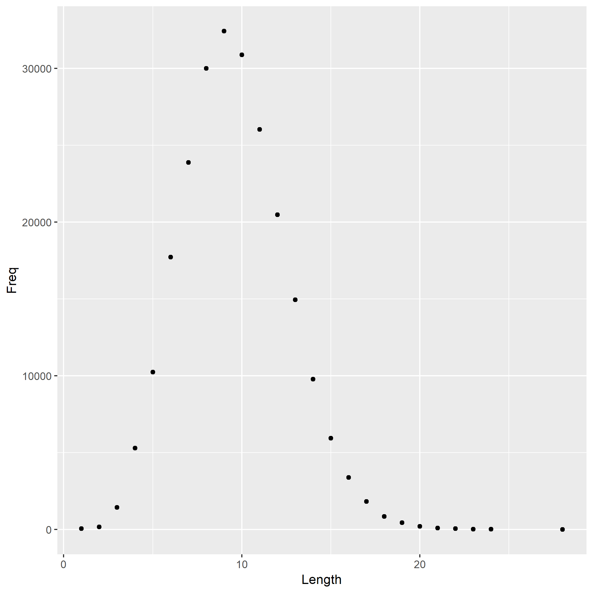

```{r load-data}
data <- read.delim("histogram.tsv")
```

```{r analyze-data}
most.common.length <- data$Length[which.max(data$Freq)]
```

The most common English word length is `r most.common.length`.